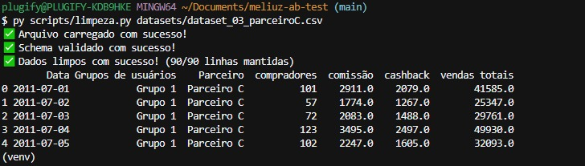

# Méliuz — Analisador Automatizado de Testes A/B de Cashback

> Solução desenvolvida para automatizar a análise de experimentos A/B de cashback do Méliuz.

A aplicação recebe um dataset CSV, realiza a limpeza e validação dos dados, calcula métricas de negócio, executa testes estatísticos, gera um relatório executivo e registra automaticamente o resultado em uma planilha de acompanhamento.

Seu objetivo é responder, de forma consistente e reproduzível, à seguinte pergunta de negócio:

> **Qual variante de cashback deve ser escalada para 100% do tráfego?**

---

## link da planilha de acompanhamento: [https://docs.google.com/spreadsheets/d/1NhJ96uVSRoWfZgLyl_7IPV5oGk-W2tUfVKtK2_7X_Lc/edit?usp=sharing](https://docs.google.com/spreadsheets/d/1NhJ96uVSRoWfZgLyl_7IPV5oGk-W2tUfVKtK2_7X_Lc/edit?usp=sharing)


# Visão Geral

```text
                    Dataset CSV
                         │
                         ▼
             Limpeza e Validação
                         │
                         ▼
          Cálculo de Métricas de Negócio
                         │
                         ▼
             Análise Estatística
                         │
                         ▼
          Geração de Relatório Executivo
                         │
                         ▼
       Registro em CSV / Google Sheets
```

A solução foi construída para ser reutilizável. Basta informar um novo dataset seguindo o mesmo schema para que toda a análise seja executada automaticamente, sem necessidade de alterar o código.

---


# Funcionalidades


| Funcionalidade                          | Status |
| --------------------------------------- | ------ |
| Leitura automática de datasets          | ✅      |
| Validação do schema                     | ✅      |
| Limpeza e normalização dos dados        | ✅      |
| Conversão de valores monetários         | ✅      |
| Cálculo de métricas por variante        | ✅      |
| Escolha automática do teste estatístico | ✅      |
| ANOVA                                   | ✅      |
| Kruskal-Wallis                          | ✅      |
| Tukey HSD (quando aplicável)            | ✅      |
| Detecção de instabilidades              | ✅      |
| Geração de relatório executivo          | ✅      |
| Registro em CSV                         | ✅      |
| Integração opcional com Google Sheets   | ✅      |
| Compatível com agentes de IA            | ✅      |


---


# Arquitetura

```text
meliuz-ab-test/

├── AGENTS.md
│   Contexto para Claude Code, Cursor, Codex e Gemini CLI

├── datasets/
│   CSVs de entrada

├── scripts/
│   ├── analisar.py
│   ├── limpeza.py
│   ├── metricas.py
│   ├── estatistica.py
│   ├── relatorio.py
│   └── planilha.py

├── prompts/
│   └── instrucoes_agente.md

├── reports/
│   Relatórios gerados

├── outputs/
│   acompanhamento_testes.csv

├── config_exemplo.py
├── requirements.txt
└── README.md
```

Cada módulo possui apenas uma responsabilidade, facilitando manutenção, testes e reutilização.

---


# Fluxo de execução

A aplicação executa automaticamente as seguintes etapas:

## 1. Limpeza e validação

- valida o schema esperado;
- converte datas;
- converte valores monetários;
- normaliza textos;
- identifica dados inválidos;
- apresenta mensagens claras caso o arquivo esteja fora do padrão.

---




## 2. Cálculo das métricas

Para cada variante são calculadas métricas como:

- compradores;
- comissão total;
- cashback distribuído;
- vendas totais (GMV);
- lucro;
- margem;
- ROI;
- ticket médio;
- cashback sobre comissão.

A recomendação utiliza métricas normalizadas para evitar decisões influenciadas apenas pelo volume de tráfego.

---


## 3. Análise estatística

A solução identifica automaticamente o teste estatístico mais adequado.

São utilizados:

- ANOVA;
- Kruskal-Wallis;
- Teste de Levene;
- Tukey HSD (quando aplicável).

Também são avaliados:

- significância estatística;
- tamanho de efeito;
- distribuição entre variantes;
- estabilidade do experimento.

---


## 4. Detecção de instabilidades

Durante a análise a aplicação verifica possíveis problemas no experimento, como:

- alteração da taxa de cashback;
- mudanças de configuração;
- possíveis contaminações.

Quando detectadas, essas ocorrências reduzem o nível de confiança da recomendação e são destacadas no relatório.

---


## 5. Relatório executivo

Ao final da execução é gerado automaticamente um relatório em Markdown contendo:

- resumo executivo;
- métricas calculadas;
- resultados estatísticos;
- alertas encontrados;
- justificativa da decisão;
- recomendação final.

O relatório foi pensado para leitura por gestores e equipes de negócio.

---


## 6. Registro do experimento

Cada análise gera automaticamente um novo registro contendo:

- nome do teste;
- descrição;
- resultado;
- decisão tomada.

Por padrão os registros são gravados em:

```text
outputs/acompanhamento_testes.csv
```

Opcionalmente, podem ser enviados diretamente para uma planilha do Google Sheets.

---


# Como executar


## 1. Criar ambiente virtual

```bash
python -m venv venv
```

Windows

```bash
venv\Scripts\activate
```

Linux/macOS

```bash
source venv/bin/activate
```

---


## 2. Instalar dependências

```bash
pip install -r requirements.txt
```

---


## 3. Executar uma análise

Exemplo:

```bash
python scripts/analisar.py datasets/dataset_01_parceiroA.csv
```

Também funciona para qualquer outro dataset:

```bash
python scripts/analisar.py datasets/dataset_02_parceiroB.csv
```

```bash
python scripts/analisar.py datasets/dataset_03_parceiroC.csv
```

Não é necessário alterar nenhuma linha de código.

---


# Saídas geradas

Após a execução são produzidos automaticamente:

- relatório executivo em Markdown;
- resumo consolidado do experimento;
- resultados estatísticos;
- histórico atualizado dos testes.

Arquivos gerados:

```text
reports/relatorio_<parceiro>.md

outputs/acompanhamento_testes.csv
```

---


# Integração com Agentes de IA

O projeto inclui um arquivo `AGENTS.md`, compatível com ferramentas como:

- Claude Code;
- Cursor;
- Codex;
- Gemini CLI.

Esses agentes conseguem compreender automaticamente:

- como executar o projeto;
- onde localizar os datasets;
- qual comando utilizar;
- como interpretar os resultados.

Exemplo de solicitação:

> Analise o arquivo `datasets/dataset_02_parceiroB.csv`.

O agente executará todo o fluxo da aplicação e apresentará a recomendação final.

Caso a ferramenta utilizada não suporte `AGENTS.md`, o arquivo `prompts/instrucoes_agente.md` pode ser utilizado como instrução manual.

---


# Google Sheets (Opcional)

Como diferencial, a solução permite registrar automaticamente os resultados em uma planilha do Google Sheets.

Configuração:

1. Criar uma Service Account no Google Cloud.
2. Baixar o arquivo `credentials.json`.
3. Copiar `config_exemplo.py` para `config.py`.
4. Informar o `GOOGLE_SHEETS_ID`.
5. Compartilhar a planilha com o e-mail da Service Account.

Caso essa configuração não seja realizada, a aplicação continua funcionando normalmente utilizando apenas o CSV de acompanhamento.

---


# Decisões de Arquitetura


## Arquitetura modular

Cada módulo possui responsabilidade única:

- limpeza;
- métricas;
- estatística;
- relatório;
- persistência.

Essa separação facilita manutenção, testes e evolução da ferramenta.

---


## Reutilização

A solução não depende dos datasets fornecidos no desafio.

Qualquer arquivo que siga o schema especificado pode ser analisado utilizando exatamente o mesmo fluxo.

---


## Robustez

A aplicação identifica automaticamente:

- dados inválidos;
- campos ausentes;
- valores inconsistentes;
- alterações de cashback;
- experimentos potencialmente contaminados.

---


## Métricas normalizadas

A recomendação é baseada em indicadores percentuais (como margem e ROI), evitando favorecer variantes apenas por terem recebido maior volume de usuários.

---


## Escolha automática do teste estatístico

A aplicação avalia as características dos dados antes de selecionar o teste estatístico apropriado, utilizando ANOVA ou Kruskal-Wallis conforme os pressupostos sejam atendidos.

---


## IA como interface, não como calculadora

Todos os cálculos estatísticos e métricas são executados em Python.

Os agentes de IA são utilizados apenas para facilitar a execução e interpretação dos resultados, evitando riscos de alucinação em operações numéricas.

---


# Achado relevante nos datasets

Durante a análise dos datasets fornecidos foi identificada uma instabilidade no experimento do **Parceiro A**.

Os grupos 1 e 3 apresentam alteração da taxa de cashback durante o período analisado, indicando uma possível mudança de configuração do experimento.

A ferramenta detecta automaticamente essa anomalia, reduz o nível de confiança da recomendação e alerta o usuário antes da tomada de decisão.

---


# Tecnologias utilizadas

- Python
- Pandas
- NumPy
- SciPy
- Statsmodels
- Markdown
- Google Sheets API (opcional)

---


# Objetivo

Mais do que responder qual variante venceu um experimento específico, esta solução foi desenvolvida para servir como uma ferramenta reutilizável de análise de testes A/B, reduzindo o tempo gasto pelo time de Operações Integradas, padronizando decisões e aumentando a confiabilidade das recomendações para novos experimentos.